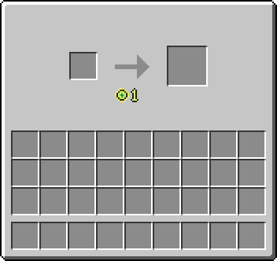
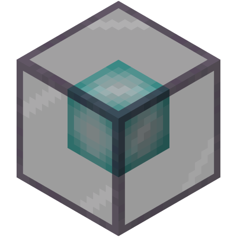
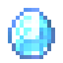
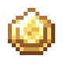
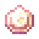
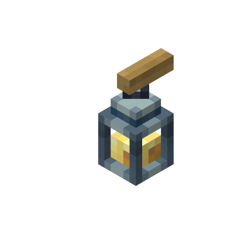
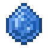
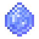
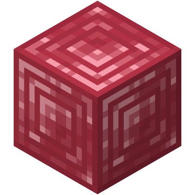

<big>[View Recipes](recipe/Recipe.md)</big>

<big>[View Ore Distribution](worldgen/OreGen.md)</big>

\* Click on each image to view recipes and ore distribution.

# Mana Injector

Details

- A crafting table that uses levels to craft items.

# Mana Anvil

Details

- A crafting table that uses enchanted gems to create items.

# Diamond

Details

- Used in the Mana Anvil to craft enchantment books for armor and tools.

# Emerald

Details

- Used in the Mana Anvil to craft enchantment books for resource gathering.

# Amethyst

Details

- Used in the Mana Anvil to craft enchantment books for melee weapons.

# Glowstone Gem

Details

- Created by smelting glowstone in a furnace.
- Used to craft light-related items.

## Glowstone Gem Lantern

- Grants a constant night vision effect while held.
- Higher levels provide better vision:
  - Level 1: 5% night vision intensity
  - Level 2: 15% night vision intensity
  - Level 3: 100% night vision intensity
- Brightness changes based on block level:
  - Level 1: Brightness level 5
  - Level 2: Brightness level 10
  - Level 3: Brightness level 15
- Supports Curios mod. Equip in the belt slot.

### Lantern Vision Effect Icon

### Holding the Glowstone Gem Lantern

Left: In hand 
Right: Equipped in Curios belt slot

## Staff of Light

- Right-click to place a light orb block.
- Durability: 300, decreases with use.
- Can be repaired with Glowstone Gems.
- Compatible with Unbreaking and Mending enchantments.

## El Dorado Staff

- Right-click to find ores within a 10-block radius (default setting).

▲ Finding diamonds.

# Sapphire

Details

- Used to craft water-related items.

## Sapphire Bucket

- Can only hold water.
- Holds up to 30 buckets of water.
- Right-click to place water, shift-right-click to collect water.

## Infinite Sapphire Bucket

- Contains infinite water.
- Right-click to place water, shift-right-click to collect water.

# Ruby

Details

- Used to craft fire-related items.

## Ruby Bucket

- Can only hold lava.
- Holds up to 30 buckets of lava.
- Right-click to place lava, shift-right-click to collect lava.

## Infinite Ruby Bucket

- Contains infinite lava.
- Right-click to place lava, shift-right-click to collect lava.

