<big>[[Home](../Main.md)]</big>

# Glowstone Gem

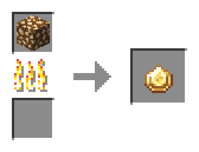

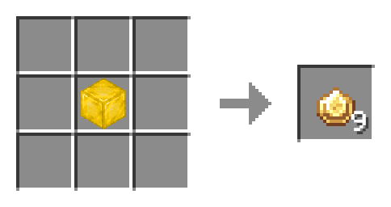

# Glowstone Gem Block

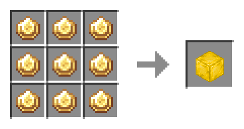

# Ruby

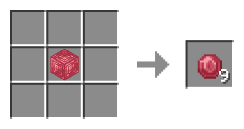

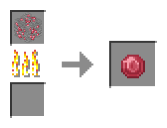

# Ruby Block

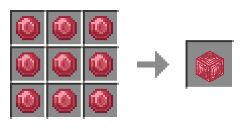

# Sapphire

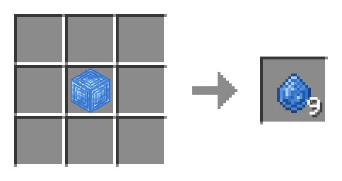

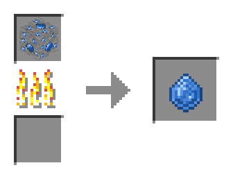

# Sapphire Block

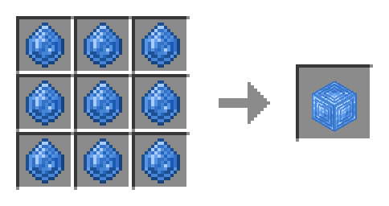

# Mana Injector

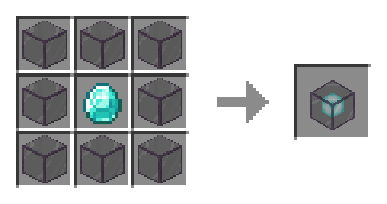

# Mana Anvil

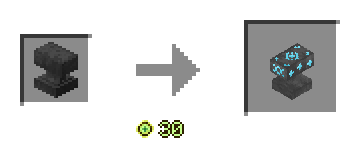

# Enchanted Diamond

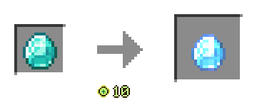

# Enchanted Emerald

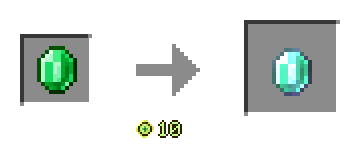

# Enchanted Amethyst Shard

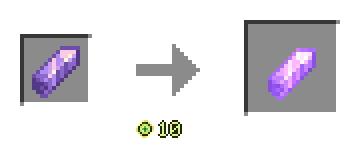

# Enchanted Glowstone Gem

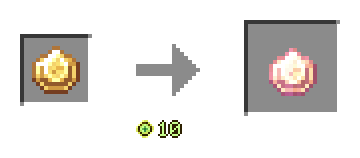

# Enchanted Ruby

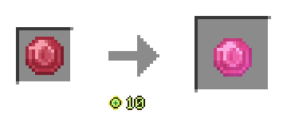

# Enchanted Sapphire

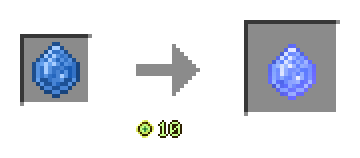

# Glowstone Gem Core

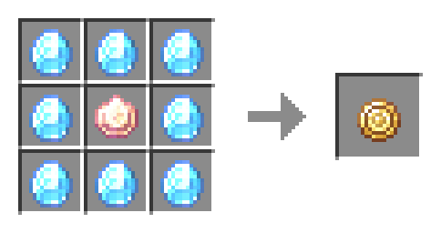

# Glowstone Gem Lantern

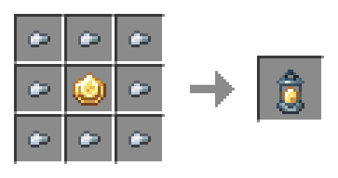

## Upgrade to Level 2

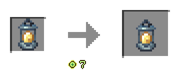

## Upgrade to Level 3

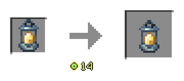

# Staff of Light

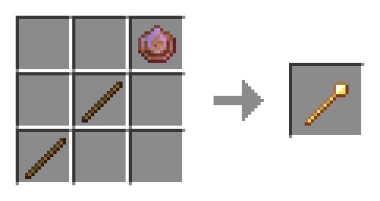

# El Dorado Staff

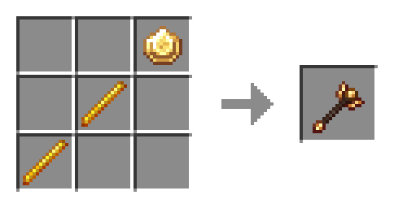

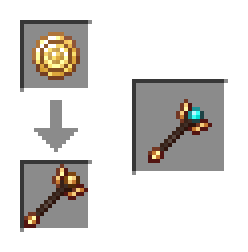

## Sapphire Bucket

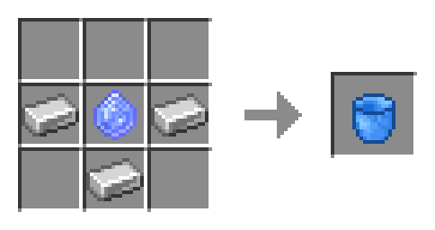

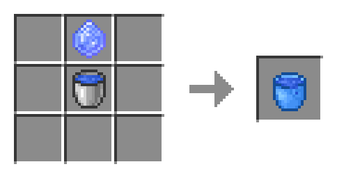

\* Contains 1 bucket.

# Infinite Sapphire Bucket

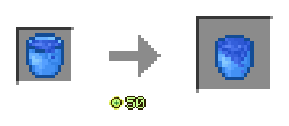

\* Requires a Sapphire Bucket containing 30 buckets of water as a material.

## Ruby Bucket

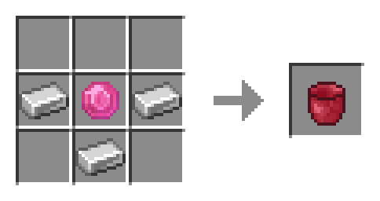

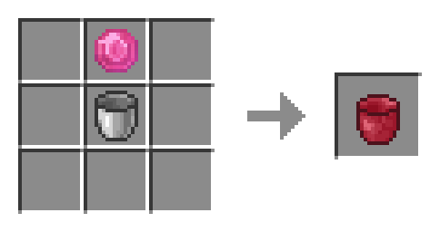

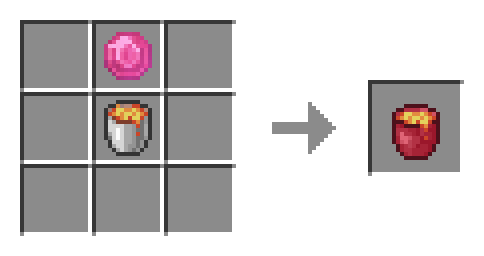

\* Contains 1 bucket.

## Infinite Ruby Bucket

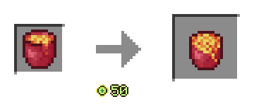

\* Requires a Ruby Bucket containing 30 buckets of lava as a material.

# [View Other Mana Anvil Recipes](ManaAnvilRecipe.md)
