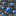
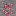
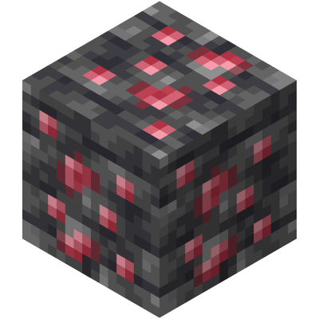

<big>[[Home](../Main.md)]</big>

Complete Ore Distribution Table

\* Reference: [Minecraft Wiki - Ore (feature)](https://minecraft.wiki/w/Ore_(feature))

| Blocks                                                                                                                                                                                       | Spawn Size | Spawn tries per Chunk | Minimum Height | Maximum Height | Ore concentrate | Skipped when air exposed | Biomes    |
|----------------------------------------------------------------------------------------------------------------------------------------------------------------------------------------------|------------|-----------------------|----------------|----------------|-----------------|--------------------------|-----------|
|  Sapphire Ore  Deepslate Sapphire Ore | 8          | 10                    | 0              | 92             | Triangle        | 0.0                      | Overworld |
|  Ruby Ore  Deepslate Ruby Ore                 | 5          | 3                     | -64            | 0              | Triangle        | 0.5                      | Overworld |
|  Ruby Ore  Deepslate Ruby Ore                 | 6          | 10                    | -64            | -48            | Uniform         | 1.0                      | Overworld |

# Sapphire

  

* Spawns above Y level 0.
* Most commonly found at Y level 46.

# Ruby

 

* Spawns below Y level 0.
* Most commonly found between Y levels -64 and -48.
* Has a very low chance of being exposed to air.
