<big>[조합법 보기](./recipe/Recipe.md)</big>

<big>[광물 분포 보기](./worldgen/OreGen.md)</big>

\* 각 이미지를 클릭해 조합법 및 광물 분포를 볼 수 있습니다.

# 마나 주입기

자세히

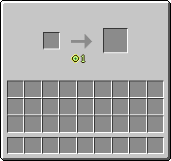[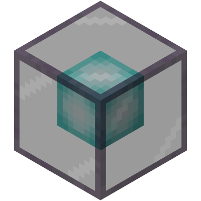](./recipe/Recipe.md#마나-주입기)

- 레벨을 사용해 아이템을 제작하는 조합대입니다.

# 발광석 보석

자세히

[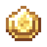](./recipe/Recipe.md#발광-보석)
[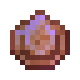](./recipe/Recipe.md#마법이-부여된-발광-보석)
[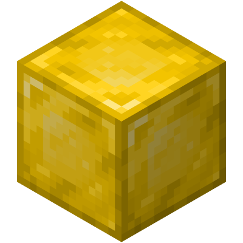](./recipe/Recipe.md#발광-보석-블록)

- 발광석을 화로에 녹여서 만듭니다.

- 빛과 관련된 아이템들을 만드는데 사용됩니다.

## 발광 보석 랜턴

[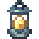](./recipe/Recipe.md#발광-보석-랜턴)
[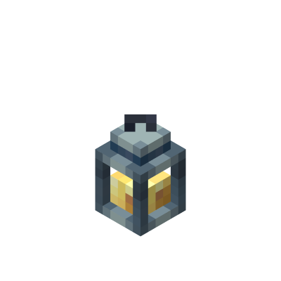](./recipe/Recipe.md#발광-보석-랜턴)
[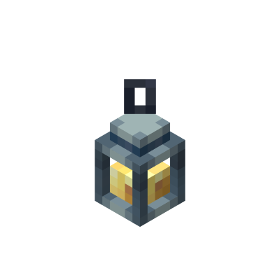](./recipe/Recipe.md#발광-보석-랜턴)
[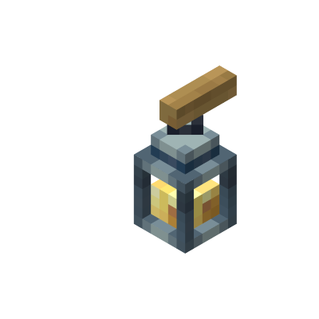](./recipe/Recipe.md#발광-보석-랜턴)

- 들고 있으면 상시 야간투시 효과인 랜턴의 불빛 효과를 받습니다.

- 레벨이 높을 수록 더 좋은 시야를 갖습니다.
    - 레벨1: 야간 투시의 5% 강도
    - 레벨2: 야간 투시의 15% 강도
    - 레벨3: 야간 투시의 100% 강도

- 블록 형태에서도 레벨에 따라 밝기가 달라집니다.
    - 레벨1: 밝기 레벨 5
    - 레벨2: 밝기 레벨 10
    - 레벨3: 밝기 레벨 15

- Curios 모드를 지원합니다. 벨트 슬롯에 착용해보세요.

### 랜턴의 불빛 이펙트 아이콘

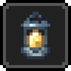

### 발광 보석 랜턴 들고 있는 모습

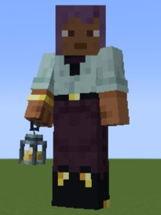
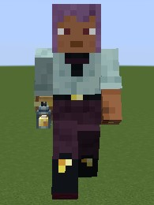

왼쪽: 손에 들고 있을 때 
오른쪽: Curios 벨트 슬롯에 장착했을 때

## 빛의 지팡이

[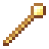](./recipe/Recipe.md#빛의-지팡이)

- 우클릭으로 빛 오브 블록을 설치합니다.

- 내구도는 300이며, 사용할 때마다 줄어듭니다.

- 발광석 보석으로 수리할 수 있습니다.

- 내구성 및 수선 인첸트를 붙일 수 있습니다.

## 사파이어

자세히

[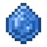](./recipe/Recipe.md#사파이어)

[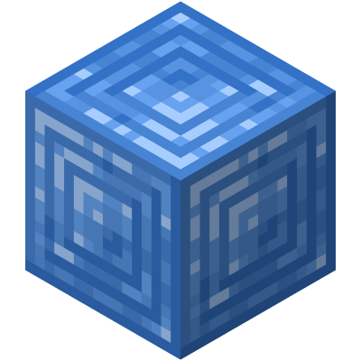](./recipe/Recipe.md#사파이어-블록)
[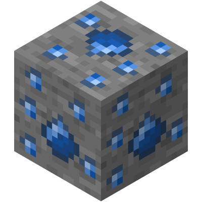](./worldgen/OreGen.md#사파이어)
[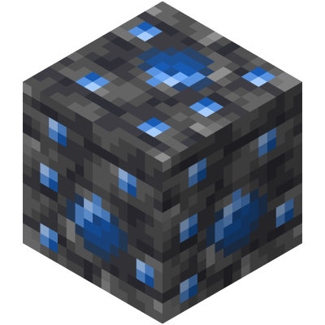](./worldgen/OreGen.md#사파이어)

- 물과 관련된 아이템을 제작하는데 사용됩니다.

## 루비

자세히

[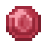](./recipe/Recipe.md#루비)

[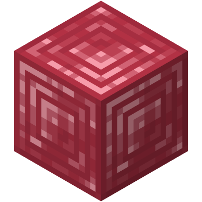](./recipe/Recipe.md#루비-블록)
[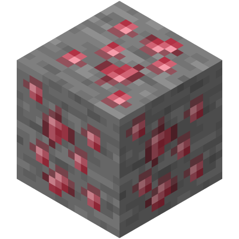](./worldgen/OreGen.md#루비)
[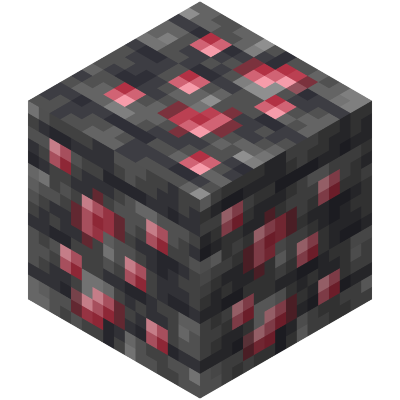](./worldgen/OreGen.md#루비)

- 불과 관련된 아이템을 제작하는데 사용됩니다.

