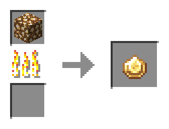
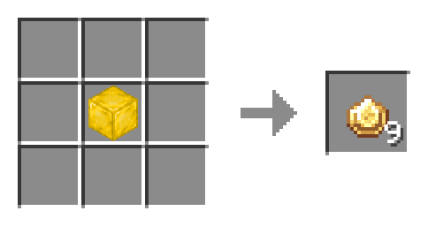
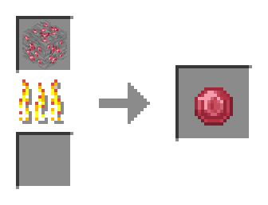
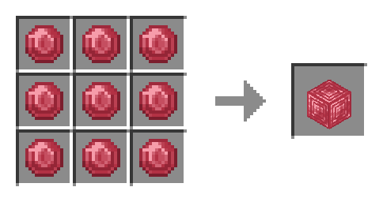
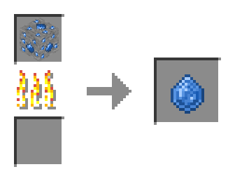
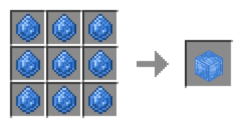
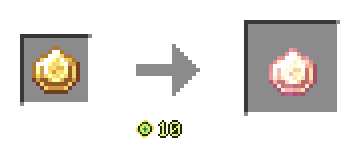

<big>[[홈으로](../Main.md)]</big>

# 발광 보석

# 발광 보석 블록

# 루비

# 루비 블록

# 사파이어

# 사파이어 블록

# 마나 주입기

# 마법이 부여된 발광 보석

# 마법이 부여된 루비

# 마법이 부여된 사파이어

# 발광 보석 랜턴

## 레벨2로 업그레이드

## 레벨3으로 업그레이드

# 빛의 지팡이
