<big>[[홈으로](../Main.md)]</big>

# 발광 보석

# 발광 보석 블록

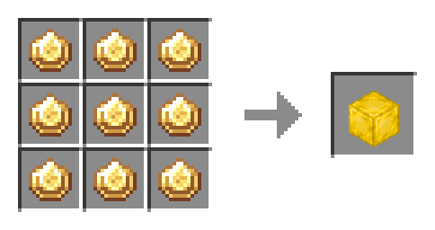

# 루비

# 루비 블록

# 사파이어

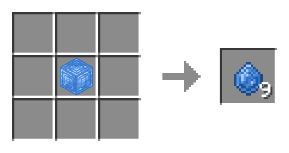

# 사파이어 블록

# 마나 주입기

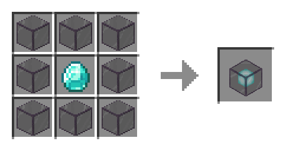

# 마나 모루

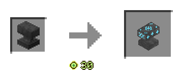

# 마법이 부여된 다이아몬드

# 마법이 부여된 에메랄드

# 마법이 부여된 자수정 조각

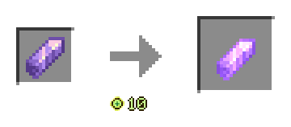

# 마법이 부여된 발광 보석

# 마법이 부여된 루비

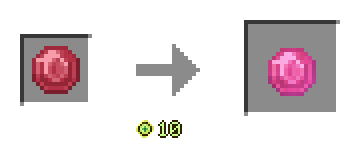

# 마법이 부여된 사파이어

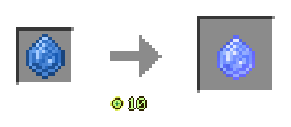

# 발광 보석 랜턴

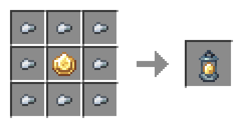

## 레벨2로 업그레이드

## 레벨3으로 업그레이드

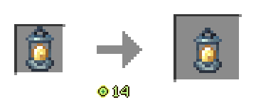

# 빛의 지팡이

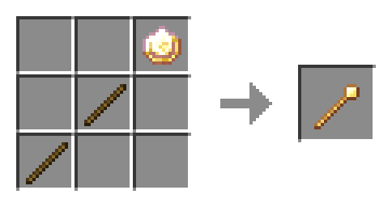

## 사파이어 양동이

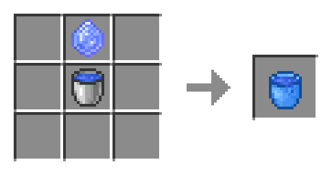

\* 1 버킷만큼 들어있음

# 무한의 사파이어 양동이
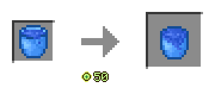

\* 물이 30버킷 만큼 들어간 사파이어 양동이가 재료로 쓰임

## 루비 양동이
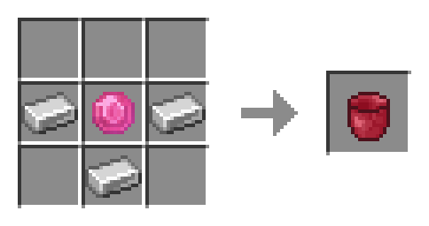

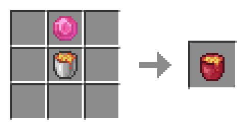

\* 1 버킷만큼 들어있음

## 무한의 루비 양동이

\* 용암이 30버킷 만큼 들어간 루비 양동이가 재료로 쓰임

# [기타 마법 모루 레시피 보기](./ManaAnvilRecipe.md)