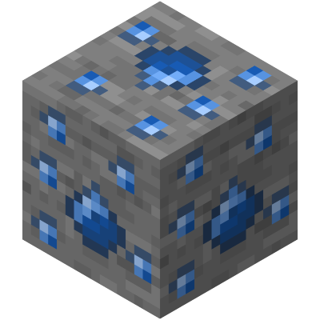
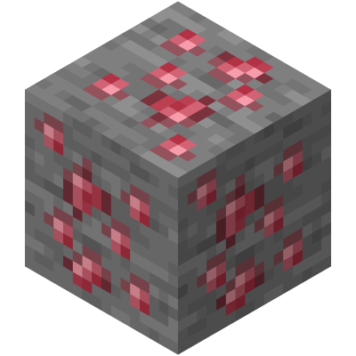

<big>[[홈으로](../Main.md)]</big>

전체 광물 분포표

\* 참고 자료: [마인크래프트 위키 - Ore (feature)](https://minecraft.wiki/w/Ore_(feature))

| 블록                                                                                                                                                                           | 생성 크기 | 청크 당 생성 시도 | 최소 높이 | 최대 높이 | 분포 타입    | 공기 노출 시 스킵 확률 | 바이옴  |
|------------------------------------------------------------------------------------------------------------------------------------------------------------------------------|-------|------------|-------|-------|----------|---------------|------|
|  사파이어 광석  심층암 사파이어 광석 | 8     | 10         | 0     | 92    | Triangle | 0.0           | 오버월드 |
|  루비 광석  심층암 루비 광석             | 5     | 3          | -64   | 0     | Triangle | 0.5           | 오버월드 |
|  루비 광석  심층암 루비 광석             | 6     | 10         | -64   | -48   | Uniform  | 1.0           | 오버월드 |

# 사파이어

 
 

* Y 0 이상에서 스폰됩니다.
* Y 46 에서 가장 많이 스폰됩니다.

# 루비

* Y 0 이하에서 스폰됩니다.
* Y -64 ~ Y -48 에서 가장 많이 스폰됩니다.
* 공기 중에 노출될 확률히 극히 낮습니다.